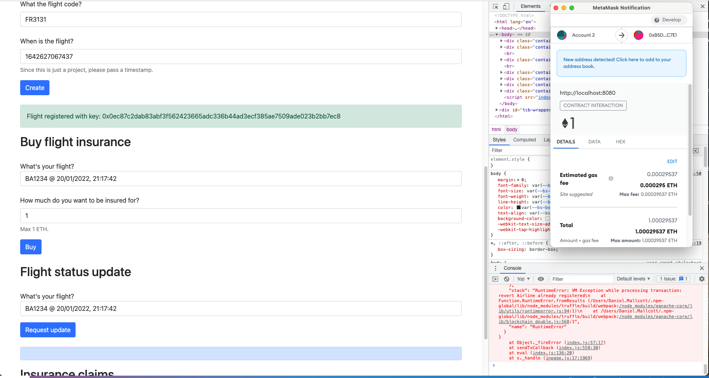
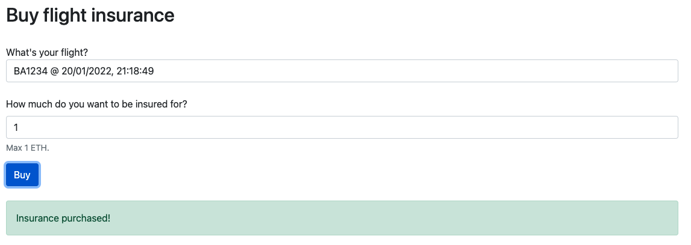
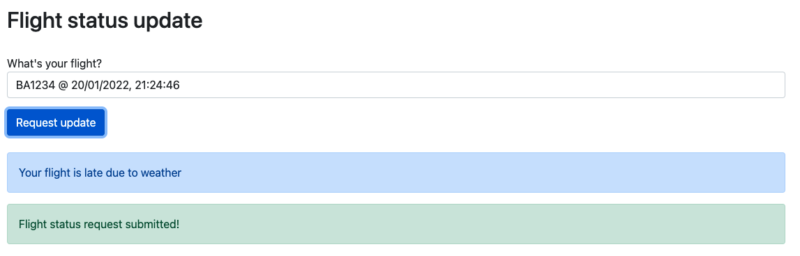
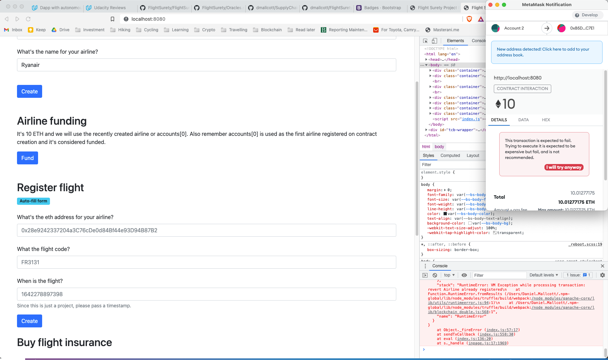
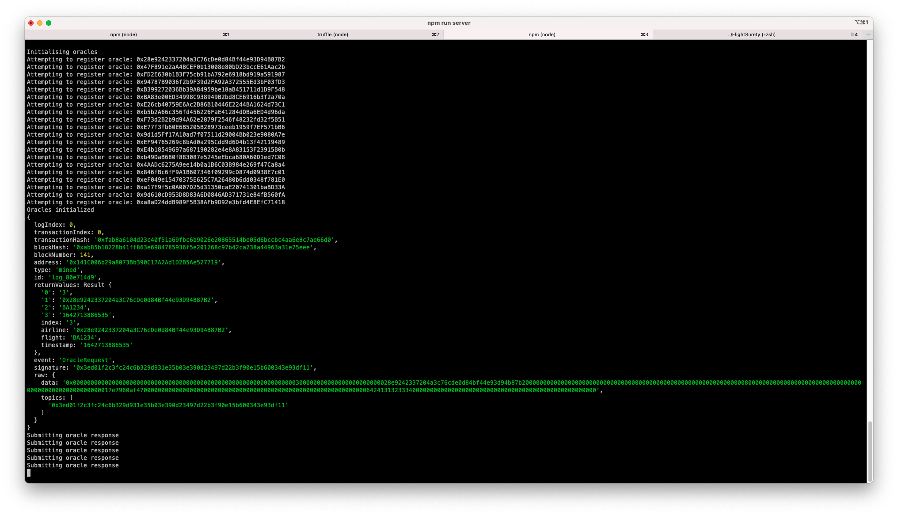
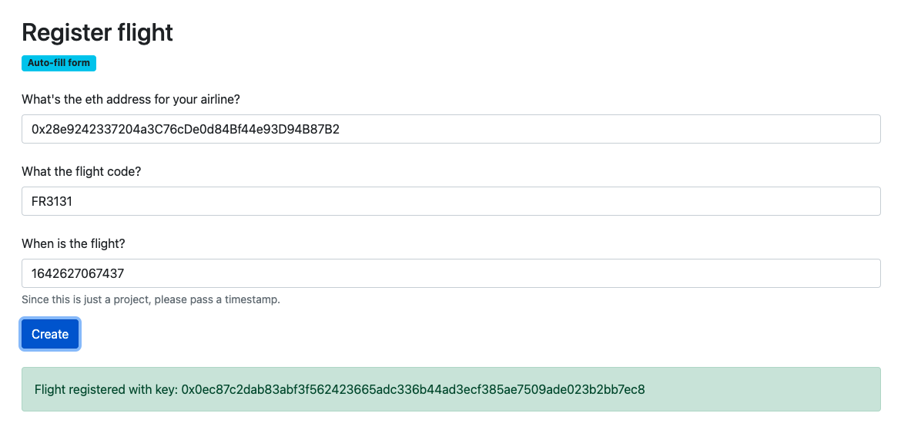
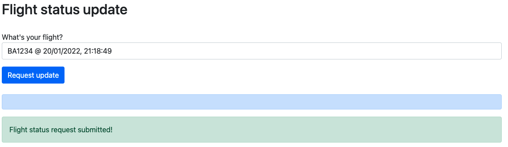

# FlightSurety

Hey there reviewer. This is my submission for the flight surety project.

## Libraries used
For the smart contracts:
* `truffle-test-utils`: used this library to simplify testing event emissions
* `truffle-assertions`: handy testing library

For the frontend:
* `webpack`: I preferred using webpack since it's more powerful that lite-server

## Version numbers

* Program: `1.0.0`
* node: `v16.5.0`
* Truffle: `v5.4.6`
* web3: `^1.2.4`

## Caveat
I am not proud of this code. I started with a very ambitious idea but had to revert everything in order to tick all rubric boxes instead. This project was unnecesarily long and I spent most of my time debugging flaky solidty methods than actually learning. `FlightSuretyApp.getRandomIndex()` (part of the provided template) literally cost me weeks of work. It literally was the solution to . 

At the very least, I can say it ticks the boxes of the rubric. But it killed the joy I had for this course and made me question if it's work finishing. 

## See it in action
For your convienience as the reviewer I've included a few images of the working project.

